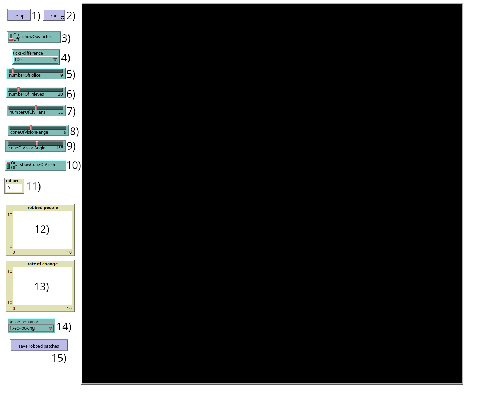
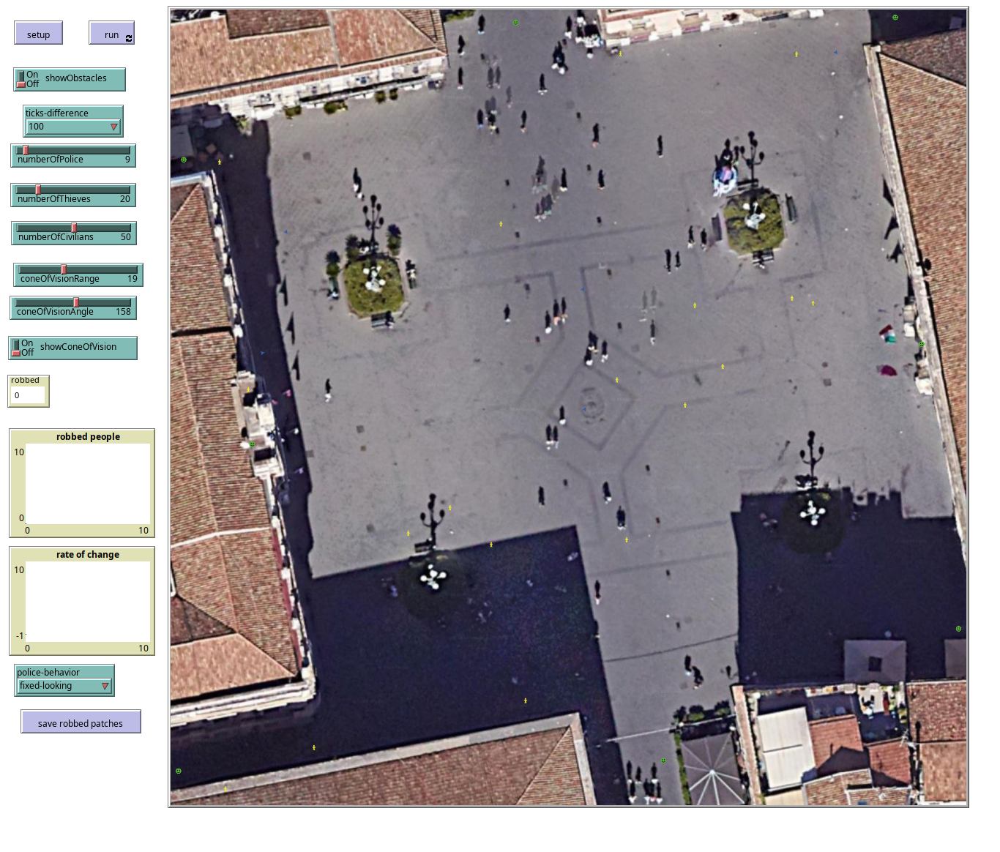
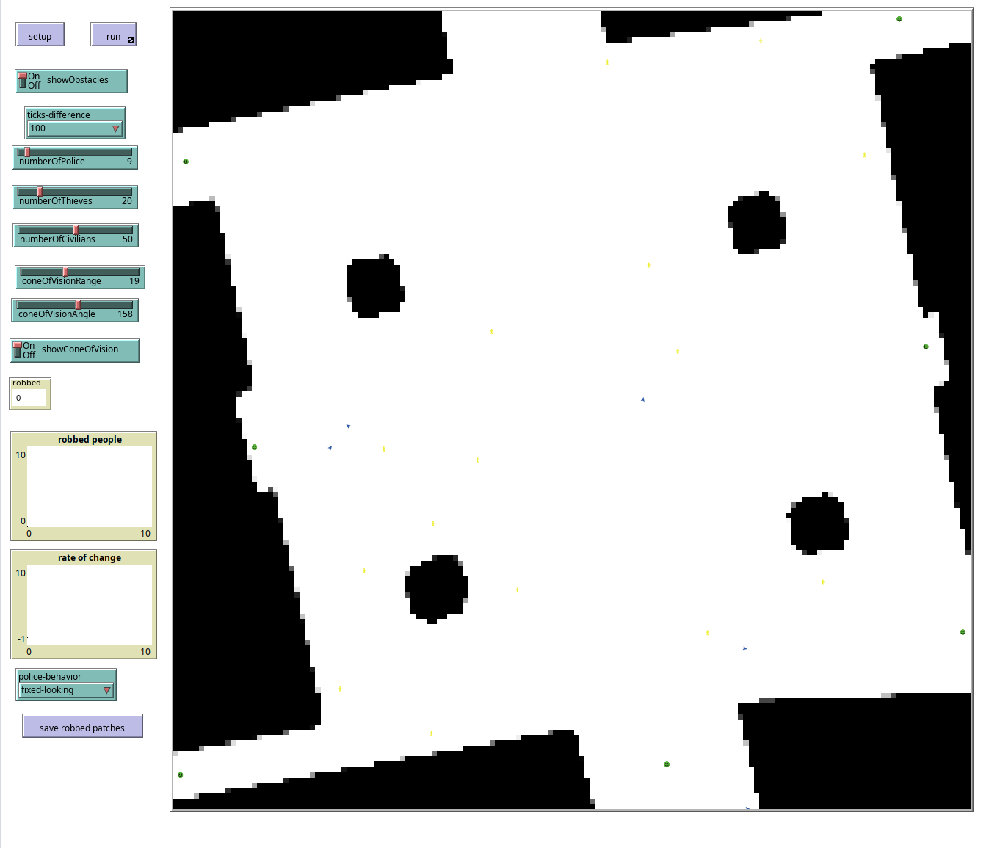
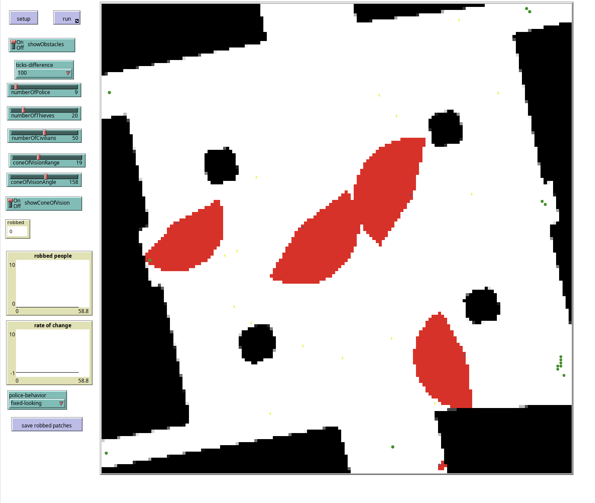

# Multi agent simulation for computing the optimal number of police officers in a specific area
In these repository, we present a multi-agent simulation for computing the optimal number of police officers in a specific area. 

The agents are divided into three categories:
- **Citizens**: they move from one entry point to one exit point, they chose the shortest path to reach their destination. They stay more time in the area if it is an area with an high flux/interest. They can be robbed more than once if they are in contact with a robber. Represented as an happy face.
- **Robbers**: they move randomly in the area, they can rob citizens. A robber can rob a citizen only if it is not watched by a police officer. Represented as people figures.
- **Police officers**: they move randomly in the area, they can watch citizens and robbers. They have a cone of vision with a specific angle and range. Represented as arrows.

The simulation is based on the NetLogo platform. Testing data was taken from the city of Catania, Italy. The simulation is based on the following assumptions:
- cone of vision range is shrinked to the lowest range that is not covered by a wall
- the area is a grid, where there are some obstacles (walls)
- there are some entry and exit points, not necessarily different (one entry point can be an exit point)
- each spot in the area has a specific interest value, that is a waiting time for the citizens. This value is between 0 and 255 (0 is the lowest interest, 255 is the highest interest)
- agents can be in the same spot at the same time
- when one citizen reaches the exit point, it is removed from the simulation, and another citizen is spawned in a random entry point

In the image above, there is the interface of the simulation. The numbers represent the following:
1. the button to setup the environment
2. the button to run the simulation
3. a switch to show the Obstacles view (not the map of the area)
4. a multi-choice to select the number of ticks used to compute the ratio of citizens that are robbed
5. a slider to set the number of police officers
6. a slider to set the number of robbers
7. a slider to set the number of citizens
8. a slider to set the maximum cone of vision range for the police officers
9. a slider to set the cone of vision angle for the police officers
10. a switch to show the cone of vision of the police officers when visualizing the Obstacles view
11. a counter to show the number of citizens that are robbed
12. the plot of the number of citizens that are robbed through the simulation
13. the plot of the ratio of robbed citizens through the simulation
14. chooser to change the movement strategy for the police officers (random or in fixed points, looking at the most robbed place in the current iteration)
15. button to save the current robbed patches with the count of robbed people for every patch

Ratio of robbed citizens doesn't work great, so it will probably be removed in the future.

Some examples of the simulation are shown below:
## setting up the environment, showing the area

## setting up the environment, showing the obstacles

## running the simulation, with obstacles view and cone of vision

